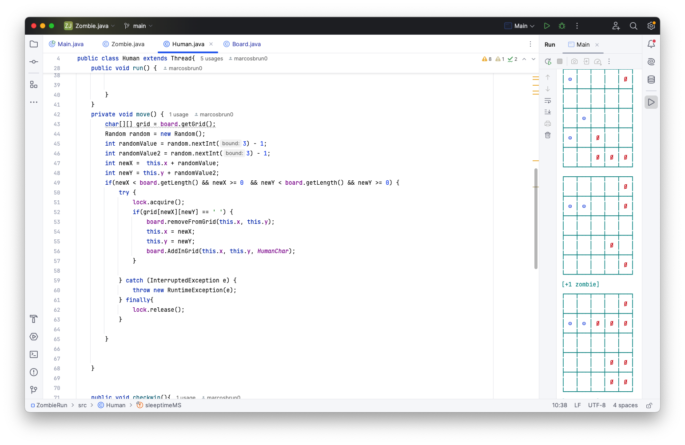

## 🧟 Zombie Run — Concorrência em Java
Simulação interativa entre humanos e zumbis usando threads Java! Cada entidade (zumbi ou humano) é representada por uma thread independente, movimentando-se em um tabuleiro compartilhado (grid) de forma concorrente. A sincronização é controlada com semáforos para evitar condições de corrida e garantir integridade do estado do jogo.

### 🎮  Descrição
Zumbis tentam alcançar e infectar humanos.

Humanos se movimentam tentando chegar à base inferior do grid.

A simulação termina se um humano vencer ou for transformado em zumbi.

O projeto explora:

Criação e controle de múltiplas threads.

Sincronização com Semaphore.

Compartilhamento seguro de memória entre threads.

Simulação concorrente em tempo real com grid dinâmico.

### 🧠 Conceitos de Concorrência Aplicados
Thread: Cada zumbi e humano roda como uma thread.

Semáforo: Utilizado para garantir que duas entidades não acessem ou modifiquem simultaneamente a mesma célula do grid.

Condições de corrida: Evitadas com controle de acesso ao grid.

###  👀 Imagens





### 🗂 Estrutura
```bash
src/
├── Main.java           # Inicializa o tabuleiro e cria as threads
├── Board.java          # Classe que representa o grid (não mostrado aqui)
├── Human.java          # Thread que simula o comportamento do humano
└── Zombie.java         # Thread que simula o comportamento do zumbi
```
### ▶️  Como Executar
Clone o repositório:
```bash
git clone https://github.com/MarcosBrun0/Concurrent_Programming.git
cd Concurrent_Programming
```
Compile e execute:
```bash
javac src/*.java
java -cp src Main

```

Certifique-se de que o terminal suporte códigos ANSI para exibição colorida dos personagens.

### 📌 Requisitos
Java 11+

Terminal com suporte ANSI (para as cores dos personagens)

### ✍️ Autor
Marcos Bruno

